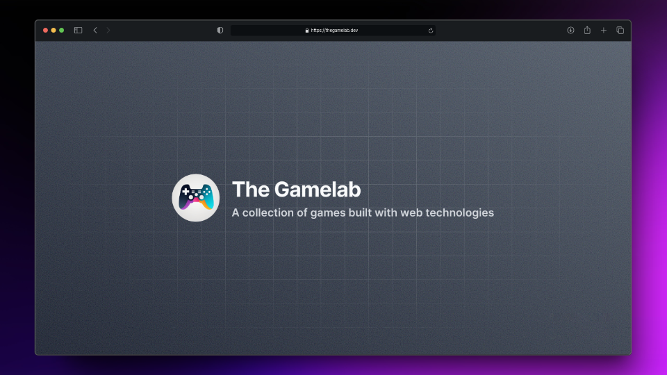

  <h1>🕹️ The Gamelab</h1>
  

  

  

<!-- For a bit of spacing -->

  🌐 <a href="https://thegamelab.dev" target="_blank">Website</a>
  &nbsp;·&nbsp;
  🔑 <a href="https://github.com/iivvaannxx/the-gamelab?tab=Apache-2.0-1-ov-file#readme">License</a>

## 🔧 Stack

  
  
  
  
  
  
  
  

## 🔥 Motivation

This project marks my exciting return to making games after a considerable hiatus. Since I graduated from college (game development degree), I've been learning and focusing on web development, leaving game development behind.

However, I've been wanting to get back into it for a while now, and I think this is the perfect opportunity to do so. Now I'm combining both interesets, merging my web expertise with my game development background to create a new project that I'm very excited about.

## ⚒️ Current State

As of this moment, there's only one game available to play. But I have already planned the next two games that I'll be working on, although I don't have the time to work on them right now, as soon as find some time, I'll start implementing them.

| 🎮 Game     | 🌐 Link                                    | 👨‍💻 Source                    |
| ----------- | ------------------------------------------ | ---------------------------- |
| Flappy Bird | [Play](https://thegamelab.dev/flappy-bird) | [Code](./games/flappy-bird/) |

## 🚀 Future Games

The following games are planned to be developed in the future (with **Tetris** being next in the line):

- **Tetris**
- **Snake**
- **Pong**
- **Arkanoid**
