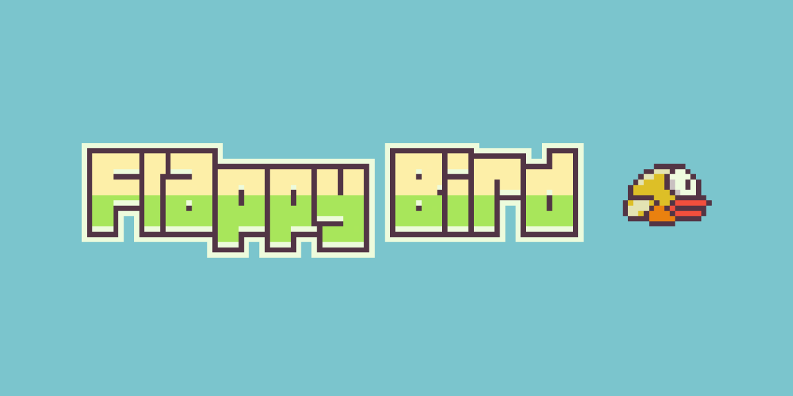

  <h1>🐥 Flappy Bird</h1>

  

  

  

  

  
<em><b>A clone of the popular Flappy Bird game. Made with Typescript and Pixi.js</b></em>

<!-- For a bit of spacing -->

  
  
  <a href="https://pixijs.com"><img hspace="6" src="https://img.shields.io/badge/Pixi.JS-e72264?style=for-the-badge&logo=data:image/svg+xml;base64,PHN2ZyB4bWxucz0iaHR0cDovL3d3dy53My5vcmcvMjAwMC9zdmciIGZpbGw9Im5vbmUiIHZpZXdCb3g9IjAgMCAzODAgMzgwIj4KICA8Y2xpcFBhdGggaWQ9ImEiPgogICAgPHBhdGggZD0iTTAgMGgzNzkuMXYzNzkuMUgweiIvPgogIDwvY2xpcFBhdGg+CiAgPGcgY2xpcC1wYXRoPSJ1cmwoI2EpIj4KICAgIDxwYXRoIGZpbGw9IiNlNzIyNjQiIGQ9Ik0zNzkuMSAwSDB2Mzc5LjFoMzc5LjF6Ii8+CiAgICA8cGF0aCBmaWxsPSIjZmZmIiBkPSJNMTg5LjUwNSA1N0MxMzUuMSA1NyA5MSAxMDEuMDU3IDkxIDE1NS40MDdjMCAxLjA2NS4wMTg0IDIuMTIxLjA1NTEgMy4xNzd2MTA0LjJsLjAwOTItLjAwOXYyMy43NzNjMCAuMTg0LS4wMDkyLjM1OC0uMDA5Mi41NDIgMCAuMTgzLjAwOTIuMzY3LjAxODQuNTUxdi40NGguMDA5MmMuNTIzOSAxOC4yNjQgMTUuNDk2MyAzMi45MSAzMy45MDczIDMyLjkxIDE4LjQxIDAgMzMuNTM5LTE0LjY0NiAzNC4wNjMtMzIuOTFWMjUzLjE3aDI4LjE0NWMuNzYyLjAxOSAxLjUzNS4wMjggMi4yOTcuMDI4IDU0LjQwNSAwIDk4LjUwNS00My40NDIgOTguNTA1LTk3Ljc5MUMyODggMTAxLjA1NyAyNDMuOTA5IDU3IDE4OS41MDUgNTd6bTAgMTI4LjI0OWgtMzAuNDI0di0yOS44MzNjMC0xNi43MjEgMTMuNjg2LTMwLjI4MyAzMC40MjQtMzAuMjgzIDE2LjczNyAwIDMwLjMxMyAxMy41NjIgMzAuMzEzIDMwLjI4M3MtMTMuNTc2IDI5Ljg0Mi0zMC4zMTMgMjkuODQyeiIvPgogICAgPGcgZmlsbC1vcGFjaXR5PSIuNSI+CiAgICAgIDxwYXRoIGZpbGw9IiMxZDFkMWIiIGQ9Ik0xMjQuMTM1IDI1My4xODloMzQuODcydjM0LjkwMmgtLjE1NkMxNTguMzI3IDMwNi4zNTQgMTQzLjM1NCAzMjEgMTI0Ljk0NCAzMjFzLTMzLjM5MjUtMTQuNjQ2LTMzLjkxNjQtMzIuOTA5aC0uMDA5MnYtLjQ0MWMwLS4xODQtLjAxODQtLjM2Ny0uMDE4NC0uNTUxcy4wMDkyLS4zNTguMDA5Mi0uNTQydi0yLjQ2YzEuMDQ3OC0xNi4zMzYgMTYuNDc5OC0zMC45MDggMzMuMTE2OC0zMC45MDh6IiBvcGFjaXR5PSIuMTUiLz4KICAgICAgPGcgZmlsbD0iIzAwMCI+CiAgICAgICAgPGcgb3BhY2l0eT0iLjA1Ij4KICAgICAgICAgIDxwYXRoIGQ9Ik05MS4wNTUyIDIxMS4yMDh2NDEuOTYzYzAtMzYuOTY4IDMxLjA5NDgtNjcuMzk4IDY4LjAwNzgtNjcuOTAzVjE3MS44OGMtMjcuNDM3IDIuODgzLTUxLjczIDE3LjYzOS02OC4wMDc4IDM5LjMyOHoiIG9wYWNpdHk9Ii41Ii8+CiAgICAgICAgICA8cGF0aCBkPSJNOTEuMTEwNCAyODQuNzQ4YzguMDE0OS01Ljg3NiAxNy43Mzk2LTkuMzM4IDI4LjIzNTYtOS4zMzhoMzkuNzI2di0yMi4yNGgtMzQuMDM2Yy0xNy45NzkgMC0zMi42NzU2IDEzLjkzLTMzLjkyNTYgMzEuNTc4eiIvPgogICAgICAgIDwvZz4KICAgICAgICA8ZyBvcGFjaXR5PSIuMDUiPgogICAgICAgICAgPHBhdGggZD0iTTE1OS4wNjMgMTg1LjI2OFYxNzMuMTFjLTI3LjY2NyAyLjcwOS01Mi4wNzkgMTcuNzg2LTY4LjAwNzggMzkuOTI1djQwLjEzNmMwLTM2Ljk2OCAzMS4wOTQ4LTY3LjM5OCA2OC4wMDc4LTY3LjkwM3oiIG9wYWNpdHk9Ii41Ii8+CiAgICAgICAgICA8cGF0aCBkPSJNMTI1LjAzNiAyNTMuMTdjLTE3LjQ5MSAwLTMxLjg4NTIgMTMuMTk1LTMzLjc5NyAzMC4xNjQgOC4wMDU4LTYuMjQ0IDE3Ljg5Ni05LjkzNSAyOC42MjItOS45MzVoMzkuMjAyVjI1My4xOGgtMzQuMDM2eiIvPgogICAgICAgIDwvZz4KICAgICAgICA8ZyBvcGFjaXR5PSIuMDUiPgogICAgICAgICAgPHBhdGggZD0iTTE1OS4wNjMgMTg1LjI2OHYtMTAuOTM2Yy0yNy45MTUgMi41MjUtNTIuNDgzIDE3Ljk2OS02OC4wMDc4IDQwLjYwNHYzOC4yMjVjMC0zNi45NjcgMzEuMDk0OC02Ny4zOTggNjguMDA3OC02Ny45MDN6IiBvcGFjaXR5PSIuNSIvPgogICAgICAgICAgPHBhdGggZD0iTTEyNS4wMzYgMjUzLjE3Yy0xNy4wMDQgMC0zMS4wNzYzIDEyLjQ2MS0zMy42MTMxIDI4Ljc0MSA3Ljk1OTctNi42MDIgMTguMDE1MS0xMC41NDEgMjguOTUzMS0xMC41NDFoMzguNjg3di0xOC4yaC0zNC4wMzZ6Ii8+CiAgICAgICAgPC9nPgogICAgICAgIDxnIG9wYWNpdHk9Ii4wNSI+CiAgICAgICAgICA8cGF0aCBkPSJNMTU5LjA2MyAxODUuMjY4di05LjcwNmMtMjguMiAyLjMzMi01Mi45MzQgMTguMTk5LTY4LjAwNzggNDEuMzg1djM2LjIyNGMwLTM2Ljk2OCAzMS4wOTQ4LTY3LjM5OCA2OC4wMDc4LTY3LjkwM3oiIG9wYWNpdHk9Ii41Ii8+CiAgICAgICAgICA8cGF0aCBkPSJNMTI1LjAzNiAyNTMuMTcxYy0xNi41MTcgMC0zMC4yNzY3IDExLjc2Mi0zMy4zNjUgMjcuMzU0IDcuODk1NS02Ljk2OSAxOC4wODktMTEuMTc1IDI5LjIyOS0xMS4xNzVoMzguMTcydi0xNi4xNzl6Ii8+CiAgICAgICAgPC9nPgogICAgICAgIDxnIG9wYWNpdHk9Ii4wNSI+CiAgICAgICAgICA8cGF0aCBkPSJNMTU5LjA2MyAxODUuMjY3di04LjQ2NmMtMjguNTMxIDIuMTEyLTUzLjQ1OCAxOC40NzUtNjguMDA3OCA0Mi4yNjZ2MzQuMTAzYzAtMzYuOTY4IDMxLjA5NDgtNjcuMzk4IDY4LjAwNzgtNjcuOTAzeiIgb3BhY2l0eT0iLjUiLz4KICAgICAgICAgIDxwYXRoIGQ9Ik0xMjUuMDM2IDI1My4xNzFjLTE2LjAyMSAwLTI5LjQ0MDIgMTEuMDY0LTMzLjA1MjUgMjUuOTQ5IDcuNzg1Mi03LjMyOCAxOC4xMDc1LTExLjc5OSAyOS40MzA1LTExLjc5OWgzNy42NDl2LTE0LjE1OWgtMzQuMDM2eiIvPgogICAgICAgIDwvZz4KICAgICAgICA8ZyBvcGFjaXR5PSIuMDUiPgogICAgICAgICAgPHBhdGggZD0iTTE1OS4wNjMgMTg1LjI2N3YtNy4yMjZjLTI4LjkwNyAxLjg5Mi01NC4wNzQgMTguODE1LTY4LjAwNzggNDMuMzA0djMxLjgyNWMwLTM2Ljk2NyAzMS4wOTQ4LTY3LjM5OCA2OC4wMDc4LTY3LjkwM3oiIG9wYWNpdHk9Ii41Ii8+CiAgICAgICAgICA8cGF0aCBkPSJNMTI1LjAzNiAyNTMuMTdjLTE1LjUxNSAwLTI4LjU4NTMgMTAuMzc2LTMyLjY3NTUgMjQuNTQ1IDcuNjQ3NS03LjY4NiAxOC4wNzA1LTEyLjQxNSAyOS41Nzg1LTEyLjQxNWgzNy4xMzN2LTEyLjEzeiIvPgogICAgICAgIDwvZz4KICAgICAgICA8ZyBvcGFjaXR5PSIuMDUiPgogICAgICAgICAgPHBhdGggZD0iTTE1OS4wNjMgMTg1LjI2OHYtNS45NzhjLTI5LjM0OSAxLjY0NC01NC44IDE5LjI0Ni02OC4wMDc4IDQ0LjUyNXYyOS4zNTZjMC0zNi45NjggMzEuMDk0OC02Ny4zOTggNjguMDA3OC02Ny45MDN6IiBvcGFjaXR5PSIuNSIvPgogICAgICAgICAgPHBhdGggZD0iTTEyNS4wMzYgMjUzLjE3Yy0xNC45OTEgMC0yNy43MTIzIDkuNjk3LTMyLjI0MzYgMjMuMTQ5IDcuNDcyNi04LjAzNSAxNy45OTY2LTEzLjAzOSAyOS42NTE2LTEzLjAzOWgzNi42MTl2LTEwLjExaC0zNC4wMzZ6Ii8+CiAgICAgICAgPC9nPgogICAgICAgIDxnIG9wYWNpdHk9Ii4wNSI+CiAgICAgICAgICA8cGF0aCBkPSJNMTU5LjA2MyAxODUuMjY4di00LjcyYy0yOS44OTEgMS4zNzctNTUuNjgyIDE5LjgwNi02OC4wMDc4IDQ2LjAxMnYyNi42MTFjMC0zNi45NjggMzEuMDk0OC02Ny4zOTggNjguMDA3OC02Ny45MDN6IiBvcGFjaXR5PSIuNSIvPgogICAgICAgICAgPHBhdGggZD0iTTEyNS4wMzYgMjUzLjE3Yy0xNC40NzYgMC0yNi44Mjk4IDkuMDQ1LTMxLjc0NzIgMjEuNzgxIDcuMjcwMi04LjM5MyAxNy44NTkyLTEzLjY5MSAyOS42NzkyLTEzLjY5MWgzNi4xMDR2LTguMDl6Ii8+CiAgICAgICAgPC9nPgogICAgICAgIDxnIG9wYWNpdHk9Ii4wNSI+CiAgICAgICAgICA8cGF0aCBkPSJNMTU5LjA2MyAxODUuMjY3di0zLjQzNGMtMzAuNTggMS4wOTMtNTYuODEzIDIwLjU1OS02OC4wMDc4IDQ3LjkxM3YyMy40MjRjMC0zNi45NjggMzEuMDk0OC02Ny4zOTggNjguMDA3OC02Ny45MDN6IiBvcGFjaXR5PSIuNSIvPgogICAgICAgICAgPHBhdGggZD0iTTEyNS4wMzYgMjUzLjE3Yy0xMy45NTMgMC0yNS45Mzg0IDguNDAyLTMxLjE3NzUgMjAuNDEzIDcuMDEzNS04Ljc1MSAxNy42NzU1LTE0LjM0MyAyOS42MzM1LTE0LjM0M2gzNS41OHYtNi4wN3oiLz4KICAgICAgICA8L2c+CiAgICAgIDwvZz4KICAgIDwvZz4KICA8L2c+Cjwvc3ZnPgo=&logoColor=white&link=https://pixijs.com" alt="Pixi.js" /></a>

  🕹️ <a href="https://ivanporto.io" target="_blank">Play</a>
  &nbsp;·&nbsp;
  🔑 <a href="https://github.com/iivvaannxx/the-gamelab?tab=Apache-2.0-1-ov-file#readme">License</a>

## 🎮 Controls

The game responds to multiple types of input. You only control the bird, and you can do so by:

- Clicking the `Left` mouse button on devices with a mouse.
- Pressing the `Space` key on devices with a keyboard.
- Tapping on the screen on touch devices.

Once you start the game (first interaction), the pipes will start moving, and the bird will start falling. You must keep the bird flying and avoid the pipes to get the highest score possible. The game will end when the bird collides with the ground or a pipe. Once the game ends, you will be presented with the game over screen and two buttons.

Pressing the `OK` button will return you to the main menu, where you can start a new game. Pressing the `Share` button will allow you to share your score on Twitter. Depending on the score you got, you'll earn a medal according to the following criteria:

- **Bronze**: Scored between 10 and 20 points.
- **Silver**: Scored between 20 and 30 points.
- **Gold**: Scored between 30 and 40 points.
- **Platinum**: Scored more than 40 points.

## 🛠️ Installation

The game is played directly from the browser, so you don't need to install anything to play it. However its prepared to be installed as a `PWA` (Progressive Web App) on your device. When you visit the game's URL, you will be prompted to install the game on your device. If you accept, the game will be "installed" on your device, and you will be able to play it offline.

On mobile devices that prompt doesn't trigger automatically (I think), you can manually install the game by following these steps:

1. Open the game's URL in your browser.
2. Click on the browser's menu button (three dots) to open the browser's menu.
3. Look for an option that says something like "Install app" or "Add to home screen" and click on it.
